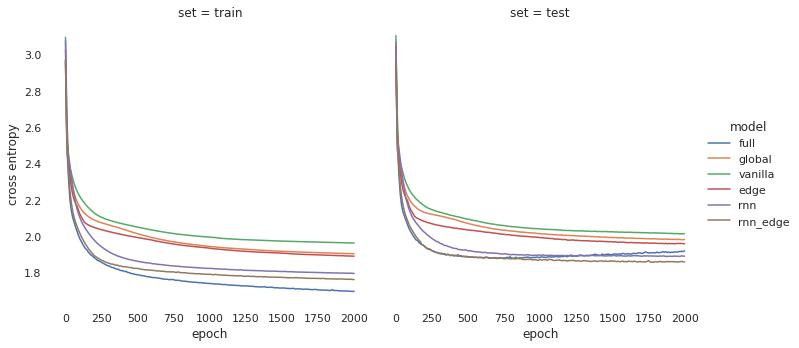
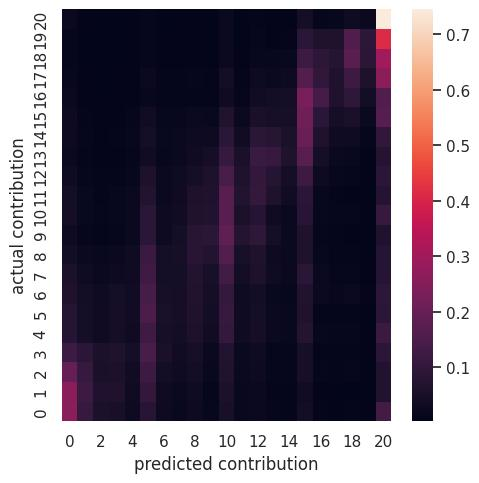
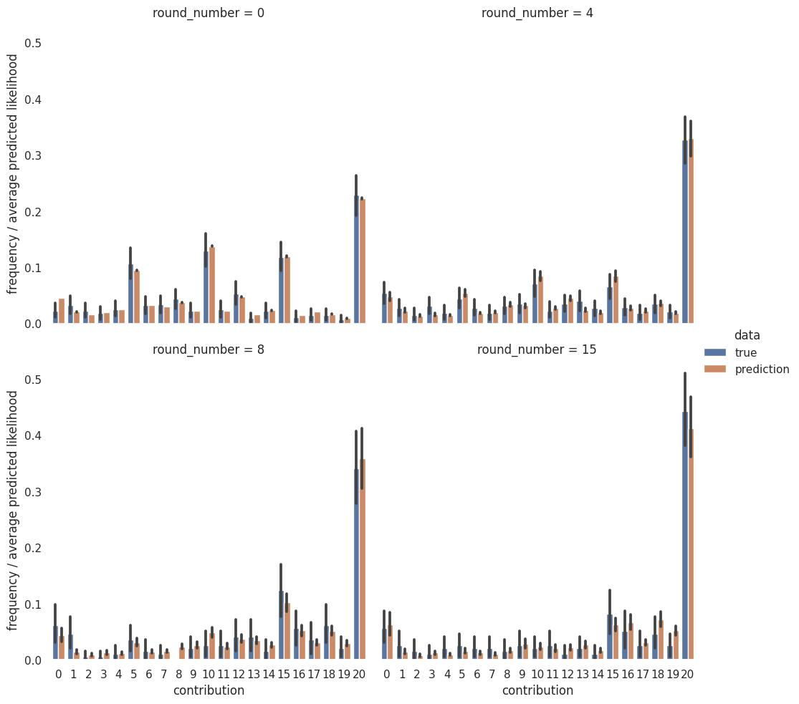
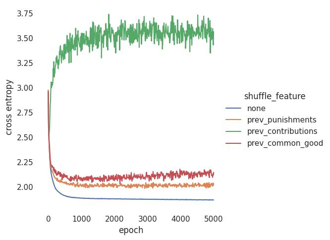
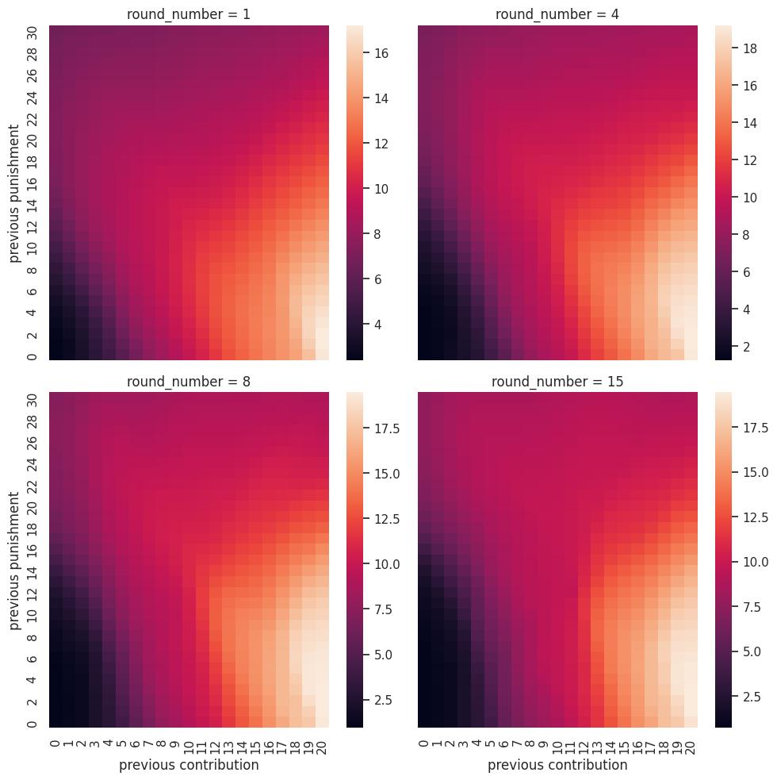
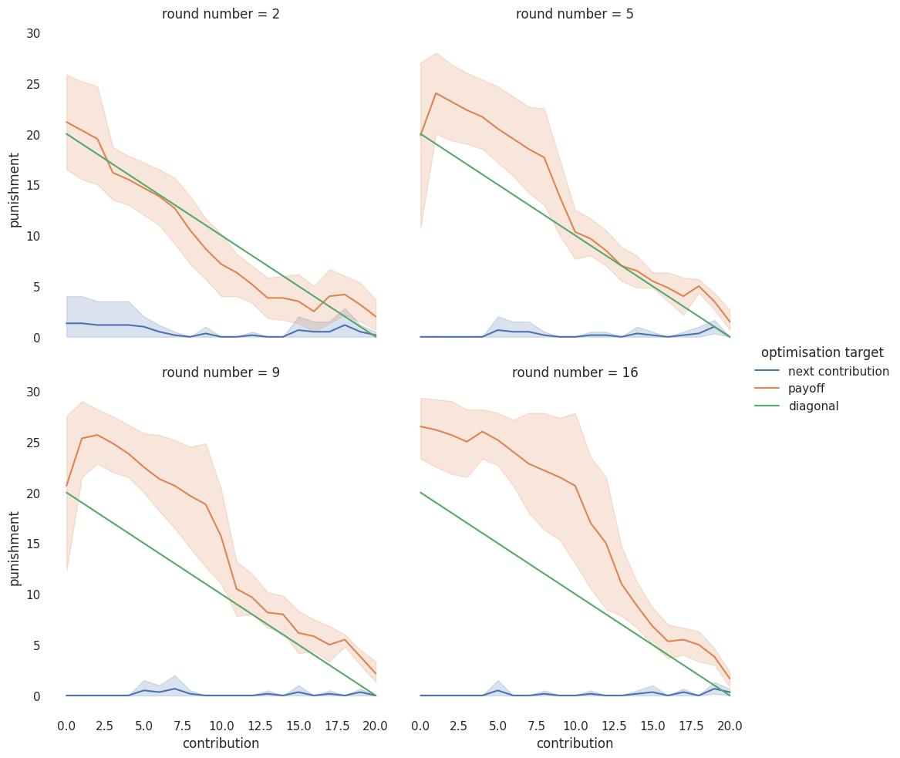

# Artificial Humans

We train 'artificial humans' that are predicting the next contribution based on historic contributions and punishments of all participants in an group. The artificial humanas are modeled with a a neural networks which architecture we are describing in the following in greater detail. In each round we predict a multinominal distribution over the 21 possible contributions for each of the 4 group members. We optimize the model on the cross entropy loss. Cases in which participants do not enter a contribution are masked. 

We investigated formulating the problem as a regression instead of a classification. However, shrinkage resulted in missing out on the extremes (i.e. contributions of 0 or 20). Also predicting contributions as point values does not allow to capture mixed stratgies, i.e. cases in which participants in a given situation randomly decide between different contributions. For this two reason we disregared this approach and sticked

We train the models using an Adam Optimizer with a learning rate of 0.001. Gradients are clamped at absolute 1 and weights are regulized with a decay of 1.e-4. We train batches of 5 groups and full episodes. 

Inputs to the model are provided at the level of the group and at the individual level. At group level the current round number and the common good of the previous round is provided. At individual level the contribution and recieved punishment of the focal agent in the previous round is provided. All inputs are scaled on the range 0 to 1.

## Neural architecture

We structure our model in three parts following recent work on graph networks (Relational inductive biases, deep learning, and graph networks). Thereby we decribe the group as a fully connected graph of four nodes. Our architecure was guided by ensuring permuation symmetry in the relationship between individuals. Furthermore, we included GRUs to allow for learning temporal relationship. By placing the GRUs after aggregating pairwise interactions, we assume that temporal relationship are relevant on the global and individual level, but not at the level of pairwise relationships. The model recieves global (round number and previous common good) and node features (previous contribution and recieved punishment). No explicit edge features are provided.

In particular, an edge model is applied to each of the 16 combination of nodes (considering order), reflecting the 16 directed edges of the fully connected graph. For each edge the global features are concatenated with the node features of the node pair. The resulting vector is then passed through a single layer perceptron. All resulting vectors from the same source node are averaged to a single vector.  

An node model is applied to each of the 4 nodes. The output of the edge model is concatenated with the global and the node features. The resulting vector is then passed through a single layer perceptron.

An global model is applied to the full group. The output of the node model is aggregated at the group level and concatenated with the global features. 

The output of the global and the node model are passed through a gated recurrent unit, concatenated and pass through a final linear layer, which then after applying a softmax operation outputs the distribution over the 21 possible contribution levels.

We use for all linear layer (with the exception of the last layer) and the the GRU the same number of output units, which we denote as 'hidden units' in the following.

```mermaid
flowchart TD
    subgraph E[Edge Model]
        E0([+]) --> E1[Linear] --> E2[Tanh]
    end
    subgraph N[Node Model]
        N0([+]) --> N1[Linear] --> N2[Tanh]
    end
    subgraph GM[Global Model]
        G0([+]) --> G1[Linear] --> G2[Tanh]
    end

G[Global] --> G0
G[Global] --> N0
G[Global] --> E0
I1[Individual A] --> E0
I2[Individual B] --> E0
N2 --> M2[Add & Norm] --> G0
E2 --> M1[Add & Norm] --> N0
I1[Individual A] --> N0

N2 --> GRU1[GRU] --> F0([+])
G2 --> GRU2[GRU] --> F0
F0 --> F1[Linear] --> F2[Softmax] --> F3[Output A]


style F3 stroke-width:0px
style G stroke-width:0px
style I1 stroke-width:0px
style I2 stroke-width:0px
```

The learning curve of the loss over 2000 episodes of training shows clearly an advantage of architecture including a recurrent unit, over those without. We found the best test set performance (here an average over 6 cross validation folds) to be a model with edge and node model, a GRU, and no global model. We will report detailed performance of this model in the following. 

## Evaluation

For all evaluation in the following, we report (if applicable) averages on cross validated test sets (k=6). Thereby always a complete group (and their full episode) is randomly assigned to one of of six folds. 

### Architecture

|  | 
| -- | 
| *Log loss over the training period of 2000 episodes for 6 different model architectures. The full model is overfitting. The model with node and edge model, as well as a GRU is performing best and is not overfitting within the observed training period.* |

### Hyperparameter

We found that very narrow networks with 5 hidden units were performing best. We scanned over the parameter batch size and learning rate.

|  | 
|:--:| 
| *Log loss after 4000 episodes for different number of hidden units and batch sizes. A batch size of 20 corresponds to 20 groups a 4 participants a 16 rounds. Data shown for a learning rate of 0.001. * |

|  | 
| -- | 
| *Log loss after 2000 and 4000 episodes for different learning rates of 0.001. Data shown for a 5 hidden units and a batch size of 10.* |

We choose a batch size of 10, a learning rate of 0.001 and 5 hidden units, as these value were consistently well performing. 

### Confusion Matrix

|  | 
| -- | 
| *Confusion matrix between predicted and actual contribution (average accross the test sets). For the predictions we are weighting each contribution level with the corresponding probabilty assigned by the model. This is different to a confusion matrix most used for classification problems, where only the class with the highest predicted probability is considered.* |

The confusion matrix shows that our model well captures most of the variance and mostly only confuses between close or adjacent contribution levels.  The model appreas to predominantly predict contributions that are a multiples of 5. Looking at the distribution of actual contributions, this appreas to be a feature of the behavior of the participants, that (in particular in early rounds) predominantly choosed contributions of 5, 10, 15, or 20. The model however appreas to well capture the distribution of contributions on average. 

|  | 
|:--:| 
| *Frequency of the different contributions at three exemplarily rounds. The actual frequencies in the tests are depicted in orange. The average predicted likelihoods for each contribution is depicted in.* |

### Feature Importance

We investigate the individual importance of the input features 'previous common good', 'previous contribution' and 'previous punishment' on the model performance, by individually shuffling them. 

We find the previous contribution to dominate the model. However, all three features do contribute. The importance of the previous common good is diminishing over time.

|  | 
| -- | 
| *Test set log loss over the training period of 5000, while shuffleing (within the test set) one of the input features 'previous common good', 'previous contribution' and 'previous punishment'.* |

### Punishment sensitivity and myopic optimal punishments

We investigated the models sensitivity to punishments, as this is most relevant for training the algorithmic institution. 

|  | 
| -- | 
| *Expected contribution in the next round conditioned on the contribution and punishment in the previous round. We show 4 exemplary rounds. Note that in all cases contribution and punishments are constant accross the full episode.* |

Generally expected contributions depend on both previous punishments and previous contributions. Also contributions increase, generally increase when the punishment matches (at least) the defected amoung (20 - contribution). Based on this analysis, we calculate a myopically optimal punishment. When optimizing on the expected next contributions the myopic optimal punishment is mostly just above the diagonal (punishment == defection). However when considering the expected net payoff for the institution (next contribution - punishment) no punishment is generally the myopic optimal choice.

|  | 
| -- | 
| *We calculate the myopically optimal punishment. We compare as target the expected next contribution of the artificial human and the expected payoff for the manager (next contribution * 1.6 - punishment). The error band reflects bootstraped 95% intervals of the different cross validation.* |

 This suggest, that punishment can only be beneficially in our specific setup, if the long term benefits in facilitating cooperation are taken into account. Furthermore, to maximise the common good, punishment have to be used sparsely and effectively.

### Data utilization

|  | 
| -- | 
| *Cross entropy over a training period of 2000 episodes. In independent runs we utilize only a fraction of the training data while keeping the test set fix. Here we present curves for a two layer perceptron (vanilla), a model with a additional GRU layer (rnn) and finally a model with an additional edge model.* |

Learning curves for different architectures show that (unsurprisingly) more complex models benefit more from additional training data. In particular the most complex model still improves considerably when using 100% instead of 80% of the training data. This suggest, that additional training data still could improve model performance. 

|  | 
| -- | 
| *Shuffled featured importance over a training period of 2000 episodes, i.e. reduction of cross entropy due to shuffleing of individual features. In independent runs we utilize only a fraction of the training data while keeping the test set fix.* |

Shuffled features importance suggest, that while the performance of model as a whole is increasing with additional traing data, the importance of individual features is changing to a much lesser degree. This could suggest, that collecting additional training data might not drastically change the sensitivity of the artificial humans on, for instance, punishments. 
