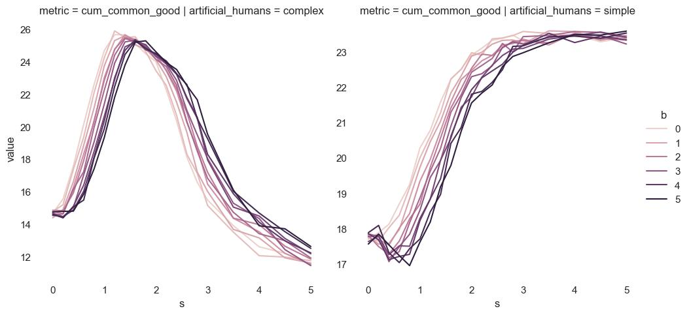
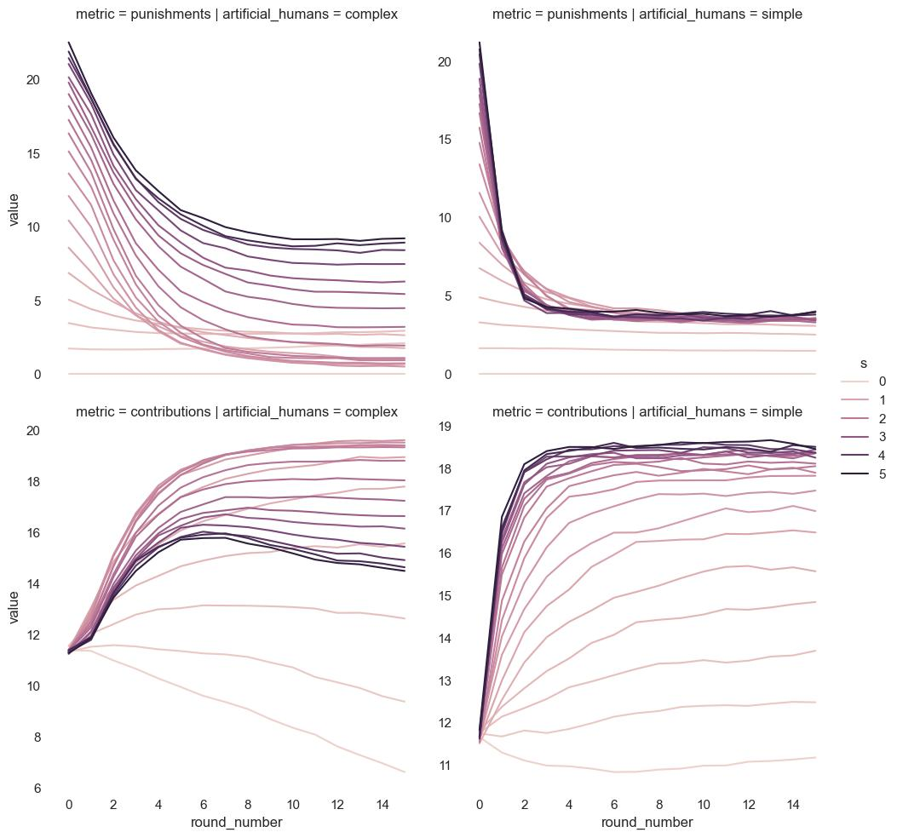
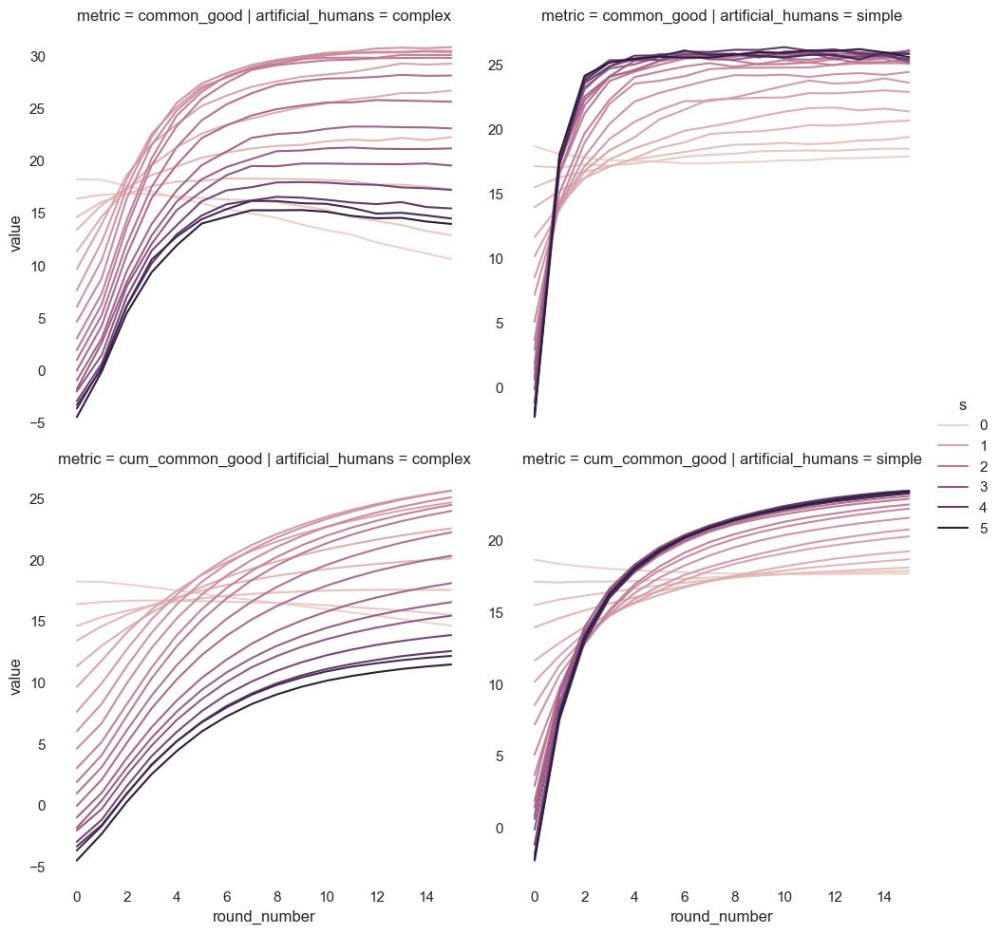
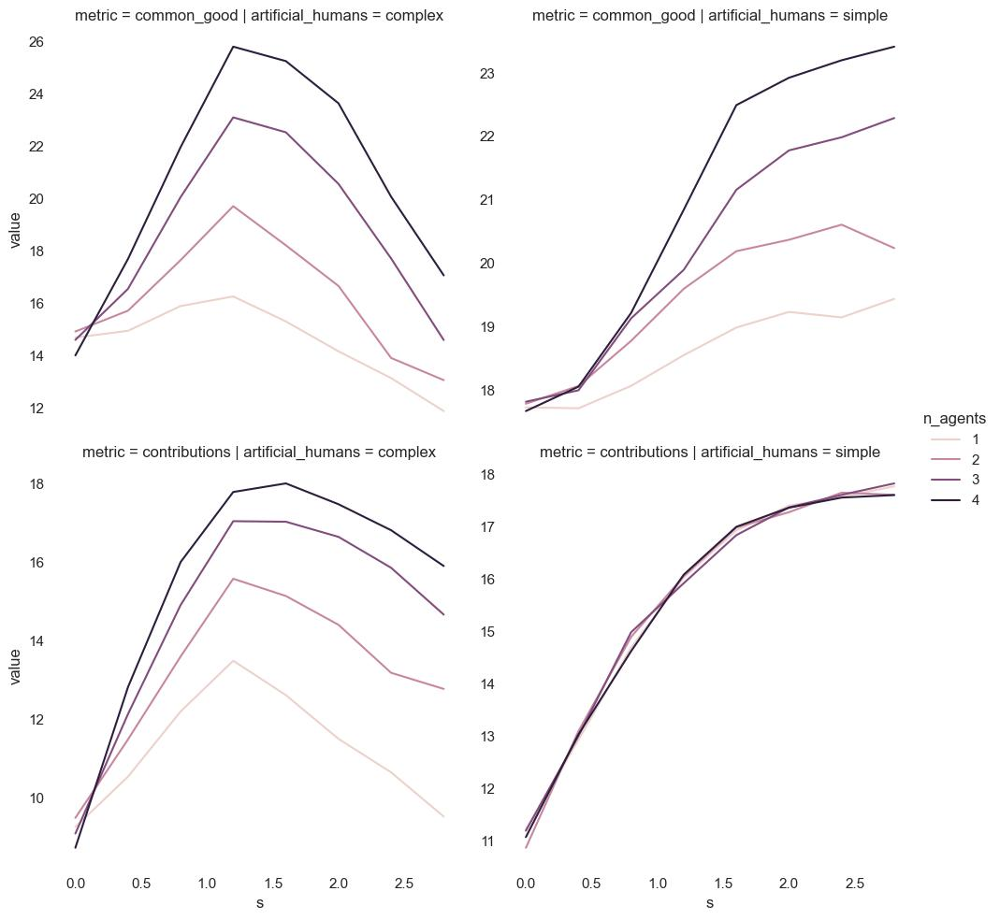

# RL manager

# Rule Manager

## Rule

$pun = (20-cont) \cdot s + (cont != 20) \cdot  c - b$

## Importance of factors

### Slope and constant punishment of defects

### Slope and constant forgiveness

### Conclusion

- Slope is the most important factor.
- Therefore we set in the following c == 0 and b == 0.
- A slope around 1.2 appears optimal for the complex AH.
- For simple AH there does not appear to a clear maximum.

## Evolution over the rounds

### Contribution and punishments over rounds

This plot shows the evolution of contributions and punishments over 16 rounds.

### Common Good and Cumulative Common Good

## Applying the rule only partially

### Apply the rule only to 1,2,3,4 agents

### Apply the rule only to some rounds - Total over episode

### Apply the rule only to some rounds - Per round

## Next

- Policy Gradient?
- Debug with simple or even more simple model
